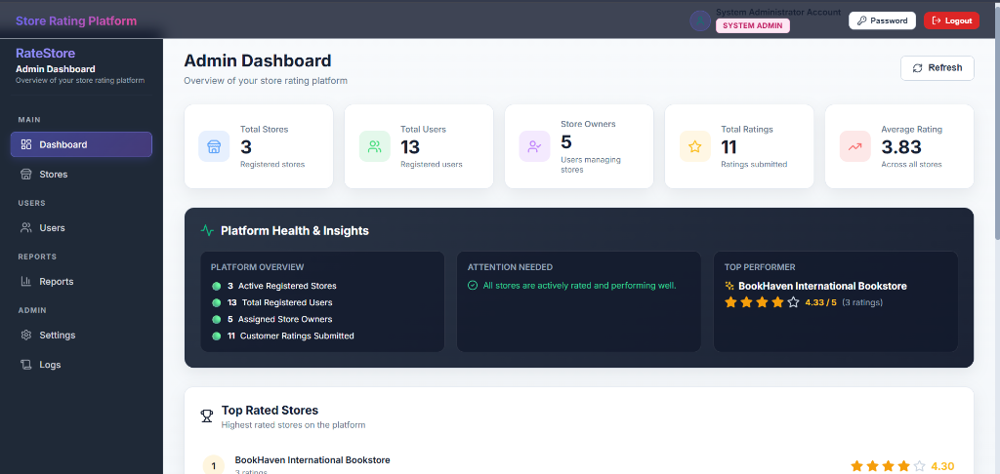
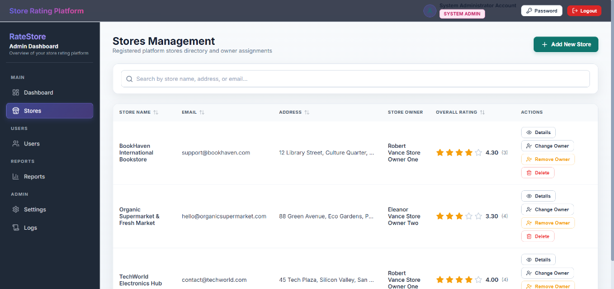
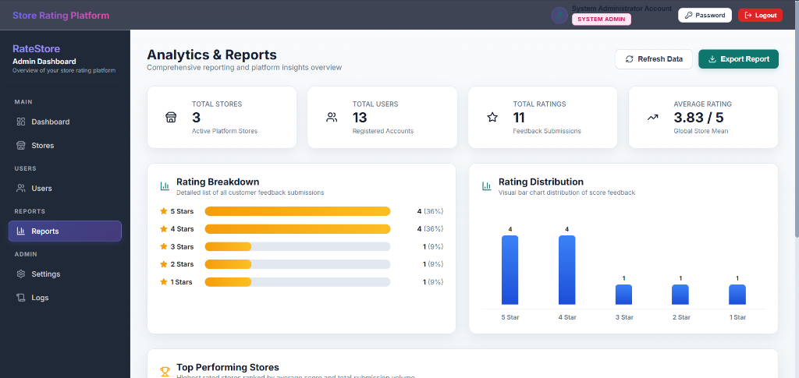
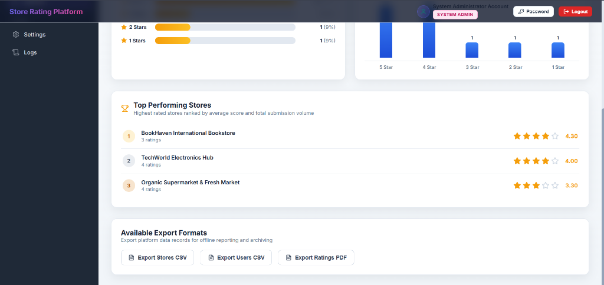
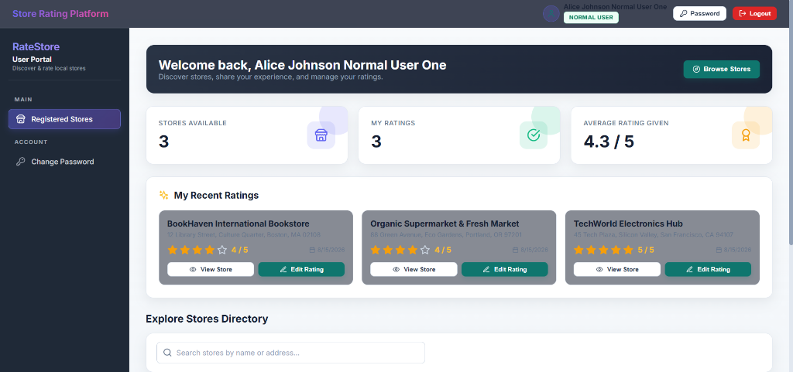
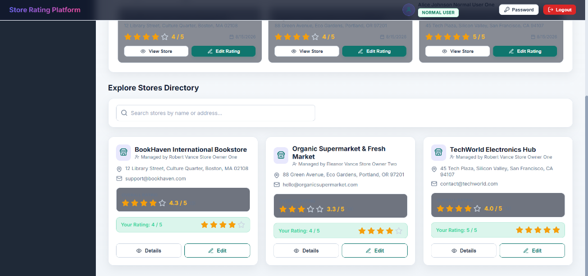
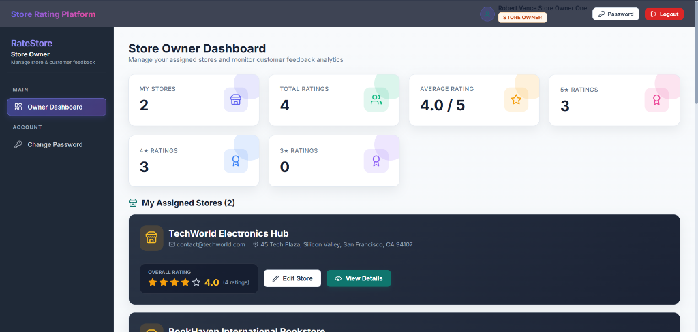
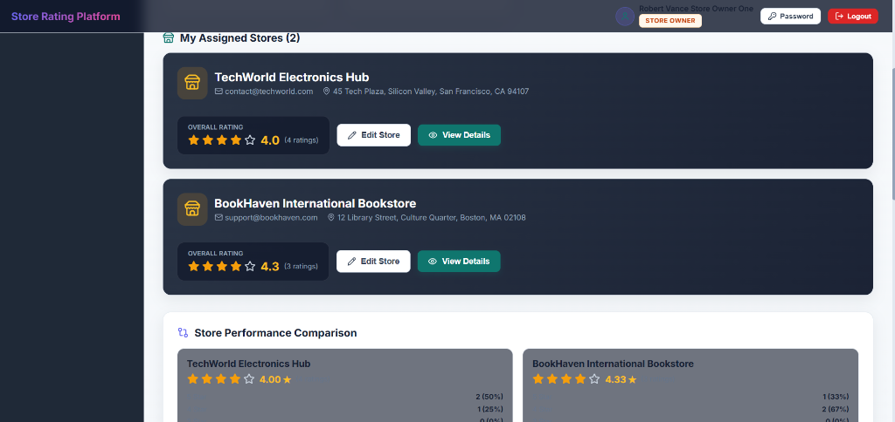
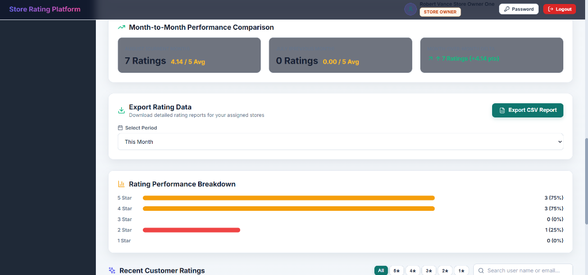
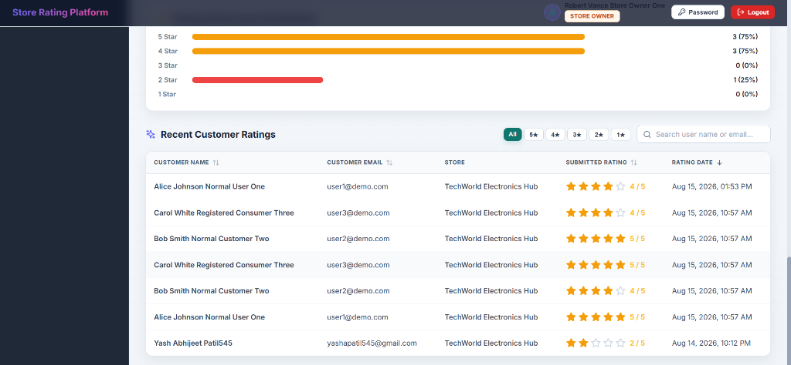

# Store Rating Platform

A production-ready full-stack web application for discovering, managing, and rating local stores with granular Role-Based Access Control (RBAC). Built with **React (Vite)** on the frontend, **NestJS (TypeScript)** on the backend, and **MySQL (TypeORM)** as the database engine.

---

## Overview

The Store Rating Platform enables customers to search for registered stores, inspect overall star ratings, and submit or modify feedback. Platform administrators manage store directories, user accounts, and owner assignments, while Store Owners access custom dashboards with feedback analytics, performance comparisons, and exportable customer rating reports.

---

## Key Features

- **Role-Based Access Control (RBAC)**: Enforces strict separation of capabilities across System Admins, Store Owners, and Normal Users.
- **Store Directory & Instant Search**: 400ms debounced search filtering by store name, address, or email.
- **Smart Store Details**: Displays address location, owner identity, 5★ to 1★ breakdown bars, star filtering, and customer rating submissions.
- **Rating Engine**: Enforces single-rating uniqueness per user per store with seamless rating modification.
- **Store Owner Analytics**: Multi-store metrics, month-over-month performance comparison, rating distribution charts, and date-filtered CSV report exports.
- **Admin Management & Audit Trail**: User and store lifecycle management, owner assignments/unassignments, and platform audit logging.
- **Idempotent Seeding & Migrations**: Reproducible database setup from scratch via TypeORM migrations and seed scripts.

---

## Role-Based Access Control

### System Admin
- Full platform management: View, create, and delete user accounts.
- Store directory management: Create stores, edit store info, delete stores.
- Store owner assignments: Assign or remove store owner relationships.
- Platform analytics: View platform health metrics, rating distribution, and top performing stores.
- Audit logging & settings: Inspect system audit log entries and platform settings.

### Store Owner
- Multi-store management: View all assigned stores with overall rating and total submission metrics.
- Store profile editing: Edit store name, email, and address for owned stores.
- Performance comparison: Compare metrics across multiple owned stores.
- Month-over-month analysis: Analyze performance deltas between current and previous month.
- Data export: Export customer ratings to CSV filtered by custom date ranges.

### Normal User
- Store discovery: Search and browse local store directory.
- Store details & breakdown: View overall star ratings and rating score distributions.
- Rating submission & editing: Submit 1–5 star ratings and update existing reviews.

---

## Screenshots

### Admin Portal

#### Admin Dashboard

*Displays platform-wide summary metrics, Platform Health & Insights overview, and Top Rated Stores ranking.*

#### Store Management

*Allows administrators to view all registered stores, assign/change store owners, remove owner assignments, and delete store entries.*

#### Reports & Analytics


*Provides a high-level analytics overview, 5-star rating breakdown bars, rating distribution chart, top performing stores, and report export buttons.*

---

### Normal User Portal

#### User Dashboard

*Welcome banner displaying user account name, summary statistic cards, quick navigation, and recent rating submissions.*

#### Store Discovery

*Searchable store directory grid showing store details, owner assignment info, overall rating badges, personal rating status, and rating submission/editing triggers.*

---

### Store Owner Portal

> **Note**: The four screenshots below represent different functional sections of the **same Store Owner Dashboard**.

#### Dashboard Overview

*Top metric cards summarizing assigned stores count, total ratings received, average store rating, and star breakdown counters.*

#### Assigned Stores & Store Comparison

*Renders cards for ALL stores assigned to the logged-in owner with quick edit and details triggers, alongside the per-store comparison section.*

#### Rating Analytics & Export

*Displays month-to-month performance deltas, custom date-range rating export controls, and 5-star rating performance breakdown.*

#### Customer Ratings

*Paginated data table displaying recent customer ratings with star filtering, search, user contact details, submitted scores, and submission timestamps.*

---

## System Architecture

The application follows a clean layered architecture with complete frontend-backend decoupling.

```
React + Vite (Frontend)
   └─► Axios / REST API
         └─► NestJS Controllers
               └─► Guards & Strategies (JWT + RolesGuard)
                     └─► NestJS Services
                           └─► TypeORM Data Layer
                                 └─► MySQL 8.0 Database
```

For comprehensive architectural design and sequence diagrams, refer to [docs/ARCHITECTURE.md](docs/ARCHITECTURE.md).

---

## Authentication & Authorization

Authentication is handled via JWT tokens issued upon successful login:

```
Login Request (POST /auth/login)
  └─► Validate Bcrypt Password Hash
        └─► Issue Signed JWT (containing user id & role)
              └─► Client stores token in localStorage
                    └─► Authenticated HTTP requests pass "Authorization: Bearer <token>"
                          └─► Passport JWT Strategy verifies token
                                └─► NestJS RolesGuard validates @Roles() metadata against user.role
```

---

## Database Architecture

The database is built on **MySQL 8.0** using **TypeORM**:

- **`users`**: Account entities storing hashed passwords, profile details, and role (`SYSTEM_ADMIN`, `STORE_OWNER`, `NORMAL_USER`).
- **`stores`**: Registered store profiles linked to a store owner via `ownerId` foreign key (`NULLABLE`).
- **`ratings`**: Customer feedback ratings (1–5 stars) with a composite `UNIQUE(userId, storeId)` constraint.
- **`audit_logs`**: Platform activity log entries for administrative oversight.

---

## API Overview

| Endpoint Route | Method | Access / Guard | Description |
| :--- | :---: | :--- | :--- |
| `POST /auth/register` | `POST` | Public | Register new customer account |
| `POST /auth/login` | `POST` | Public | Authenticate user & issue JWT |
| `POST /auth/change-password` | `POST` | JWT Protected | Update user password |
| `GET /stores` | `GET` | JWT Protected | Paginated store list with search & user rating status |
| `GET /stores/:id` | `GET` | JWT Protected | Retrieve single store details |
| `POST /stores` | `POST` | Admin | Register new store |
| `PUT /stores/:id` | `PUT` | Store Owner / Admin | Update store profile |
| `PUT /stores/:id/owner` | `PUT` | Admin | Assign or reassign store owner |
| `DELETE /stores/:id/owner` | `DELETE` | Admin | Remove store owner assignment |
| `DELETE /stores/:id` | `DELETE` | Admin | Delete store & associated ratings |
| `POST /ratings` | `POST` | Normal User | Submit rating for a store |
| `PUT /ratings/:id` | `PUT` | Normal User | Modify existing rating |
| `GET /owner/dashboard` | `GET` | Store Owner | Owner metrics & assigned stores list |
| `GET /owner/export-ratings` | `GET` | Store Owner | Date-filtered rating CSV export |
| `GET /owner/analytics` | `GET` | Store Owner | Store comparison & month-over-month performance |
| `GET /admin/dashboard` | `GET` | Admin | System statistics counters |
| `GET /admin/users` | `GET` | Admin | Paginated user directory |
| `DELETE /admin/users/:id` | `DELETE` | Admin | Delete user account |
| `GET /admin/reports` | `GET` | Admin | Platform reports & rating distribution |
| `GET /admin/logs` | `GET` | Admin | Audit log entries |

For detailed API payload schemas and response formats, refer to [docs/API.md](docs/API.md).

---

## Technology Stack

- **Frontend**: React 18, Vite, React Router v6, Axios, Lucide Icons, Vanilla CSS (Glassmorphism design system).
- **Backend**: NestJS, TypeScript, TypeORM, Passport.js, JWT, Bcrypt, Class Validator.
- **Database**: MySQL 8.0 with relational foreign keys, indexes, and composite unique keys.
- **CI / CD**: GitHub Actions (`.github/workflows/ci.yml`).

---

## Project Structure

```
store-rating-platform/
├── .github/
│   └── workflows/
│       └── ci.yml                 # GitHub Actions CI workflow
├── backend/
│   ├── src/
│   │   ├── admin/                 # Admin controller & service
│   │   ├── auth/                  # JWT auth, passport strategy, bcrypt
│   │   ├── common/                # Guards, decorators, filters
│   │   ├── database/              # Data source, entities, migrations, seed
│   │   ├── logs/                  # Audit logging service
│   │   ├── owner/                 # Owner dashboard & analytics service
│   │   ├── ratings/               # Ratings controller & service
│   │   ├── stores/                # Stores controller & service
│   │   ├── users/                 # Users controller & service
│   │   ├── app.module.ts          # Root backend module
│   │   └── main.ts                # Application entrypoint
│   └── package.json
├── database/
│   ├── README.md                  # Database documentation
│   └── schema.sql                 # SQL schema reference
├── docs/
│   ├── API.md                     # API reference documentation
│   ├── ARCHITECTURE.md            # System architecture specification
│   └── screenshots/               # Application UI reference screenshots
├── frontend/
│   ├── src/
│   │   ├── components/common/     # UI components (Table, Modal, Rating, Cards)
│   │   ├── context/               # AuthContext
│   │   ├── layouts/               # DashboardLayout shell
│   │   ├── pages/                 # Admin, Owner, User & Auth views
│   │   ├── routes/                # AppRoutes & ProtectedRoute
│   │   ├── services/              # Axios API client
│   │   ├── App.jsx
│   │   ├── index.css              # Custom styling design system
│   │   └── main.jsx
│   └── package.json
├── .gitignore                     # Repository exclusion rules
├── README.md                      # Main repository documentation
└── store-rating-platform.zip
```

---

## Installation & Setup

### 1. Prerequisites
- **Node.js**: v18.0.0+
- **npm**: v9.0.0+
- **MySQL Server**: v8.0+ running on `localhost:3306`

### 2. Environment Configuration
```bash
# Backend configuration
cd backend
cp .env.example .env
# Edit .env to set DB_USERNAME and DB_PASSWORD if needed
```

### 3. Database Initialization & Seeding
```bash
# Install backend dependencies
cd backend
npm install

# Run database migrations (creates schema and tables)
npm run migration:run

# Seed demo accounts, stores, ratings, and audit logs
npm run seed

# Start NestJS backend API server (runs on http://localhost:3001)
npm run start:dev
```

### 4. Frontend Setup
```bash
# In a second terminal window
cd frontend
npm install

# Start Vite dev server (runs on http://localhost:3000)
npm run dev
```

---

## Demo Accounts

The database seed populates demo accounts for testing all application roles:

| Role | Email | Password | Assigned Scope & Capabilities |
| :--- | :--- | :--- | :--- |
| **SYSTEM ADMIN** | `admin@demo.com` | `Admin@1234` | Full platform control: Users, stores, owner assignments, reports, settings, audit logs. |
| **STORE OWNER 1** | `owner1@demo.com` | `Owner@1234` | Manages "TechWorld Electronics Hub" & "BookHaven International Bookstore". Owner dashboard & rating exports. |
| **STORE OWNER 2** | `owner2@demo.com` | `Owner@1234` | Manages "Organic Supermarket & Fresh Market". Owner dashboard & feedback analytics. |
| **NORMAL USER 1** | `user1@demo.com` | `User@1234` | Customer account. Store discovery, ratings submission, & review editing. |
| **NORMAL USER 2** | `user2@demo.com` | `User@1234` | Customer account. Store discovery, ratings submission, & review editing. |
| **NORMAL USER 3** | `user3@demo.com` | `User@1234` | Customer account. Store discovery, ratings submission, & review editing. |

*(Backup accounts `admin@storerating.com`, `owner1@storerating.com`, `user1@storerating.com` are also available with identical passwords).*

---

## Production Build

```bash
# Build Backend (outputs to backend/dist)
cd backend
npm run build

# Build Frontend (outputs to frontend/dist)
cd frontend
npm run build
```

---

## Repository Security & Hygiene

- **`.env` files**: Excluded via `.gitignore` (`.env.example` templates provided).
- **Dependencies**: `node_modules/` excluded from repository tracking.
- **Build Artifacts**: `dist/` and `build/` directories excluded.
- **Credentials**: Zero hardcoded secrets or passwords committed.

---

## Future Improvements

- **Email Verification**: Implement email token verification for user registration.
- **Store Banner Image Uploads**: Add Cloud Storage / S3 image upload support for store headers.
- **Owner Response System**: Allow store owners to reply directly to customer feedback reviews.
