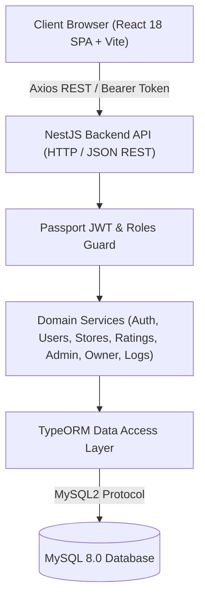
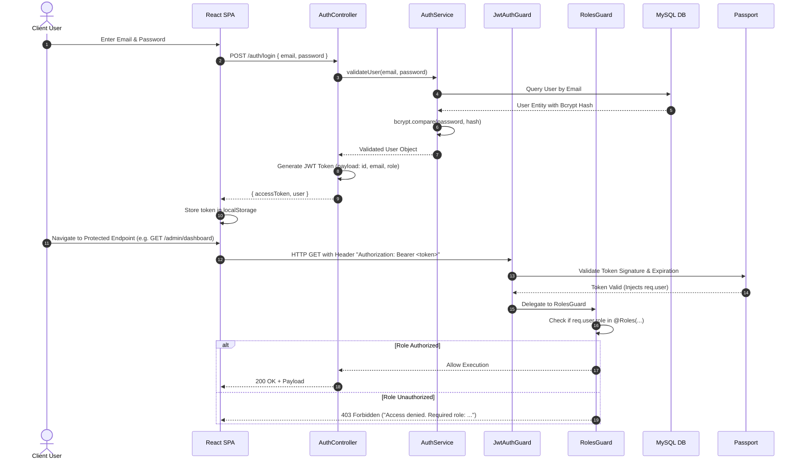
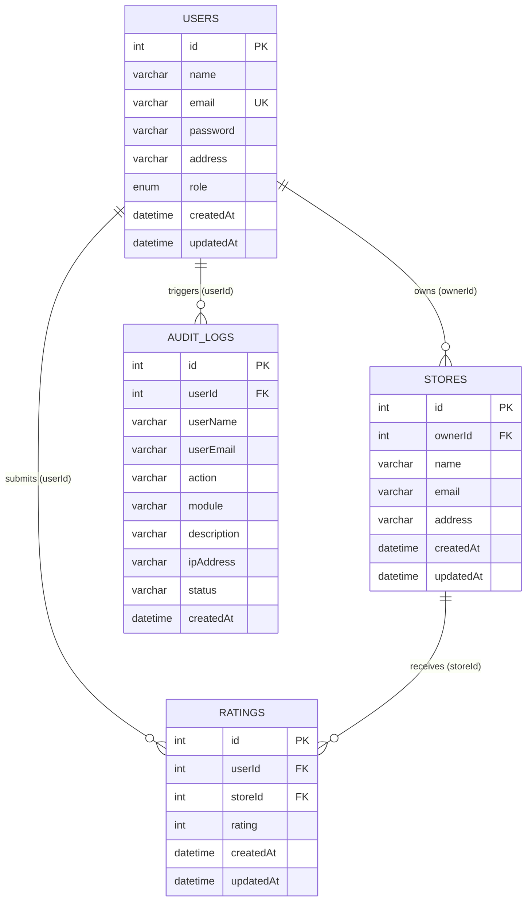

# System Architecture & Technical Specifications

This document details the high-level architecture, module decomposition, security workflows, database design, and end-to-end data flow of the **Store Rating Platform**.

---

## 1. System Overview

The Store Rating Platform is a decoupled, monolithic full-stack application built for role-based store management, customer ratings, and operational analytics.



---

## 2. Frontend Architecture

The frontend is a single-page application (SPA) constructed using **React 18**, **Vite**, **React Router v6**, and **Context API**.

### Layout & Routing Model
- **`AppRoutes.jsx`**: Centralized route definitions split by authentication state and role access.
- **`ProtectedRoute.jsx`**: Wrap-around guard component checking JWT token presence and role permissions before rendering target page views.
- **`AuthContext.jsx`**: Global authentication state manager handling token storage (`localStorage`), user state persistence, login/logout actions, and toast notifications.
- **`DashboardLayout.jsx`**: Shell component embedding responsive `Sidebar` navigation, top `Navbar`, role badging, and view container.

### Component Structure
```
frontend/src/
├── components/
│   └── common/
│       ├── ConfirmDialog.jsx      # Reusable confirmation modal
│       ├── DataTable.jsx          # Dynamic sorting & paginated table
│       ├── Modal.jsx              # Reusable modal container
│       ├── Navbar.jsx             # Top bar with user profile & password triggers
│       ├── Pagination.jsx         # Controls for paginated datasets
│       ├── Sidebar.jsx            # Responsive role-aware sidebar navigation
│       ├── StarRating.jsx         # Interactive/Read-only 1-5 star rating component
│       ├── StatCard.jsx           # Metric summary card with icons
│       ├── StoreDetailsModal.jsx  # Detailed store profile & breakdown modal
│       └── Toast.jsx              # Application-wide feedback alerts
├── context/
│   └── AuthContext.jsx            # User state & authentication context
├── layouts/
│   └── DashboardLayout.jsx        # Shell wrapper component
├── pages/
│   ├── admin/                     # System Admin views (Dashboard, Users, Stores, Reports, Settings, Logs)
│   ├── auth/                      # Authentication views (Login, Register, ForgotPassword)
│   ├── owner/                     # Store Owner views (Dashboard, ChangePassword)
│   └── user/                      # Normal User views (Stores Directory, ChangePassword)
└── services/
    └── api.js                     # Axios instance with request/response interceptors
```

---

## 3. Backend Architecture

The backend is built with **NestJS**, adhering to modular architecture, dependency injection, and controller-service isolation.

### Module Topology
```
backend/src/
├── admin/       # Admin statistics, user directory, store oversight, audit logs
├── auth/        # Authentication, JWT issuance, bcrypt validation, Passport JWT strategy
├── common/      # Global filters, role decorators, JWT & RBAC guards
├── database/    # Data source config, TypeORM entities, migrations, seed script
├── logs/        # System audit logging service
├── owner/       # Store owner dashboard metrics, rating exports, comparison analytics
├── ratings/     # Rating submission, modification, and store aggregated stats
├── stores/      # Store registration, ownership assignment, search/filter, update
└── users/       # Account creation, deletion, referential integrity guards
```

---

## 4. Authentication & Authorization Flow

Authentication relies on **JSON Web Tokens (JWT)** and **Bcrypt** password hashing.



---

## 5. Role-Based Access Control (RBAC) Matrix

| Endpoint Route | HTTP Method | Public | Normal User | Store Owner | System Admin |
| :--- | :---: | :---: | :---: | :---: | :---: |
| `/auth/register` | `POST` | ✅ | ✅ | ✅ | ✅ |
| `/auth/login` | `POST` | ✅ | ✅ | ✅ | ✅ |
| `/auth/change-password` | `POST` | ❌ | ✅ | ✅ | ✅ |
| `/stores` | `GET` | ❌ | ✅ | ✅ | ✅ |
| `/stores/:id` | `GET` | ❌ | ✅ | ✅ | ✅ |
| `/stores` | `POST` | ❌ | ❌ | ❌ | ✅ |
| `/stores/:id` | `PUT` | ❌ | ❌ | ✅ (Owned) | ✅ |
| `/stores/:id/owner` | `PUT` / `DELETE` | ❌ | ❌ | ❌ | ✅ |
| `/stores/:id` | `DELETE` | ❌ | ❌ | ❌ | ✅ |
| `/ratings` | `POST` | ❌ | ✅ | ❌ | ❌ |
| `/ratings/:id` | `PUT` | ❌ | ✅ (Own) | ❌ | ❌ |
| `/owner/dashboard` | `GET` | ❌ | ❌ | ✅ | ❌ |
| `/owner/export-ratings` | `GET` | ❌ | ❌ | ✅ | ❌ |
| `/owner/analytics` | `GET` | ❌ | ❌ | ✅ | ❌ |
| `/admin/*` | `GET` / `DELETE` | ❌ | ❌ | ❌ | ✅ |

---

## 6. Database Architecture & Relational Schema

The database utilizes **MySQL 8.0** configured with foreign key constraints, indexes, and unique composite keys.



### Relational Constraints
- **`ratings.UNIQUE(userId, storeId)`**: Ensures a user can submit at most 1 rating per store. Subsequent submissions invoke update logic.
- **`stores.ownerId -> users.id`**: Foreign key linking a store to a `STORE_OWNER` user account (`NULLABLE` when unassigned).
- **`ratings.userId -> users.id` & `ratings.storeId -> stores.id`**: Foreign key constraints maintained with service-layer cascade deletion to prevent orphaned rating records.

---

## 7. Deployment & Build Specifications

### Build Commands
- **Backend Build**: `cd backend && npm run build` (outputs compiled JavaScript to `dist/`)
- **Frontend Build**: `cd frontend && npm run build` (outputs optimized SPA asset bundle to `dist/`)

### Environment Variable Requirements
- `DB_HOST`, `DB_PORT`, `DB_USERNAME`, `DB_PASSWORD`, `DB_DATABASE`
- `JWT_SECRET`, `JWT_EXPIRES_IN`
- `PORT` (Backend API default: `3001`)
- `VITE_API_URL` (Frontend API URL default: `http://localhost:3001`)
